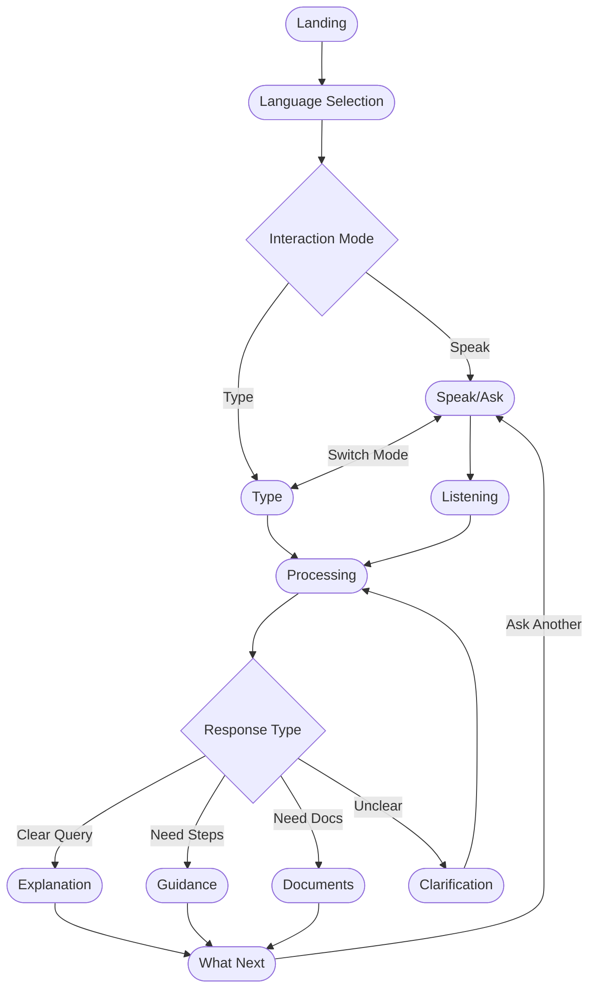

# SaralAI - Complete UI/UX Flow

## 🚀 Quick Start
```bash
cd c:\Users\siddh\Desktop\SaralAI
npm run dev
```
Then open **http://localhost:5174/** (or 5173 if available) in your browser.

---

## 📱 Complete Screen Flow (11 Screens)

### Screen 1: Landing / Welcome
**Route:** `#landing` (or no hash)
- App name: **SaralAI**
- Animated government building icon with pulsing rings
- Tagline: *"A simple helper to understand government services"*
- Subtitle: *"Voice-first AI assistant"*
- Single CTA: **Start** button
- Gradient background with professional look

---

### Screen 2: Language Selection
**Route:** `#language`
- Title: *"Choose the language you are comfortable with"*
- Grid of 8 Indian languages:
  - English, हिंदी (Hindi), বাংলা (Bengali), తెలుగు (Telugu)
  - मराठी (Marathi), தமிழ் (Tamil), ગુજરાતી (Gujarati), ಕನ್ನಡ (Kannada)
- Stagger animation on cards
- Voice hint: "You can also say the name of the language"
- CTA: **Continue** button

---

### Screen 3: Interaction Mode Selection ⭐ NEW
**Route:** `#interactionmode`
- Title: *"How would you like to ask your question?"*
- Two large option cards:
  1. **Speak** (Primary, with "Recommended" badge)
     - Mic icon, gradient blue styling
     - Description: "Talk naturally in your language"
  2. **Type** (Secondary)
     - Keyboard icon
     - Description: "Write your question if you prefer typing"
- Hint: "You can switch between modes anytime"
- Auto-navigate on selection

---

### Screen 4A: Speak Your Question
**Route:** `#speak`
- Large central microphone button with pulsing animations
- Title: *"Speak in your language"*
- Example query: *"Ghar ke liye sarkari madad kaise milegi?"*
- Secondary option: **Type instead** button
- Footer: "Protected by Government Secure Services"

---

### Screen 4B: Type Your Question ⭐ NEW
**Route:** `#type`
- Large text input area (textarea)
- Placeholder: *"E.g., How can I apply for a ration card?"*
- Character counter (0/500)
- Quick example chips:
  - Aadhaar Card, PM Awas Yojana, Ration Card, Pension Scheme
- CTA: **Ask** button
- Voice switch: "Prefer to speak instead?"

---

### Screen 5: Listening State
**Route:** `#listening`
- Animated microphone with sound waves
- Status text: *"Sun raha hoon..."* (Listening...)
- Subtext: *"Speak clearly, I am listening"*
- **Stop** button
- Auto-transitions to Processing after 3 seconds (demo)

---

### Screen 6: Processing State
**Route:** `#processing`
- Soft loading animation (spinner)
- Title: *"Samajh raha hoon..."* (Understanding...)
- Subtext: *"Finding the best information for you"*
- **Cancel** button (in case of timeout)
- Auto-transitions to Explanation after 3 seconds (demo)

---

### Screen 7: Clarification Screen (Conditional)
**Route:** `#clarification`
- Title: *"Thoda aur samjhaiye"* (Please clarify a bit more)
- Subtext: *"I want to make sure I understand correctly"*
- Selectable clarification cards:
  - Job/Employment related
  - Housing/Home related
  - Health benefits related
- Microphone button for voice response
- Auto-navigate after selection

---

### Screen 8: Simplified Answer
**Route:** `#explanation`
- Title: *"Simple Explanation"*
- Audio player: "Listen to explanation" with animated waveform
- Numbered step-by-step instructions (3-5 steps)
- Action buttons:
  - **Back** (ghost)
  - **What's Next?** (primary) → goes to WhatNext screen
  - **Ask Another Question** (secondary) → goes to Speak screen

---

### Screen 9: Follow-up Actions
**Route:** `#whatnext`
- Summary card with scheme information
- Title: *"What would you like to do next?"*
- Options:
  - **Explain again** → Explanation screen
  - **What documents are needed?** → Documents screen
  - **Tell me more** → Guidance screen
- Small microphone button: "Tap to speak"

---

### Screen 10: Documents & Requirements
**Route:** `#documents`
- Step badge: "Step 2 of 3"
- Title: *"Documents you will need"*
- Interactive checklist with animations:
  - ✓ Aadhaar Card
  - ✓ Income Certificate
  - ☐ Residence Proof
  - ☐ Bank Account Details
- Missing documents notice with info
- CTAs: **Back** and **I have all documents**

---

### Screen 11: What Next / Guidance
**Route:** `#guidance`
- Progress indicator: Step 1 of 3 (33% complete)
- Title: *"What to do next"*
- Step cards with stagger animations:
  1. Visit nearest office
  2. Submit documents
  3. Wait for verification
- Voice assistant hint: "Ask me if you have any questions"
- CTA: **Start Process** button

---

## 🎨 Design System

### Colors
- **Primary Blue:** `#2563EB` (Government Trust Blue)
- **Primary Dark:** `#1D4ED8`
- **Background:** `#FFFFFF` to `#F0F4FF` gradient
- **Text Primary:** `#111827`
- **Text Secondary:** `#6B7280`

### Typography
- **Font:** Inter (Google Fonts)
- **Headings:** Bold/Semibold
- **Body:** Regular 400

### Animations
- `fadeIn`, `slideUp`, `slideDown`, `scaleIn`
- `pulse` (microphone rings)
- `wave` (audio player)
- Stagger animations for lists
- Hover transforms on cards

### Accessibility
- ✅ Reduced motion support
- ✅ High contrast mode
- ✅ Focus visible styles
- ✅ Print styles

---

## 📁 Project Structure

```
SaralAI/
├── index.html              # Entry HTML
├── package.json            # Dependencies
├── PROJECT_STATUS.md       # This file
├── public/
│   └── favicon.svg         # Custom SaralAI favicon
└── src/
    ├── main.js             # App entry point (routing, styles injection)
    ├── router.js           # Hash-based routing (12 routes)
    ├── state.js            # State management
    ├── icons.js            # SVG icons library
    ├── styles/
    │   └── index.css       # Design system
    ├── components/
    │   ├── Header.js
    │   ├── Button.js
    │   ├── MicButton.js
    │   ├── LanguageCard.js
    │   ├── AudioPlayer.js
    │   ├── ProgressIndicator.js
    │   ├── ChecklistItem.js
    │   └── StepCard.js
    └── screens/
        ├── LandingScreen.js        # Screen 1
        ├── LanguageScreen.js       # Screen 2
        ├── InteractionModeScreen.js # Screen 3 ⭐ NEW
        ├── SpeakScreen.js          # Screen 4A
        ├── TypeScreen.js           # Screen 4B ⭐ NEW
        ├── ListeningScreen.js      # Screen 5
        ├── ProcessingScreen.js     # Screen 6
        ├── ClarificationScreen.js  # Screen 7
        ├── ExplanationScreen.js    # Screen 8
        ├── WhatNextScreen.js       # Screen 9
        ├── DocumentsScreen.js      # Screen 10
        └── GuidanceScreen.js       # Screen 11
```

---

## 🔀 Navigation Flow



### Quick Reference: All Routes

| Route | Screen | Description |
|-------|--------|-------------|
| `#landing` | Landing | Welcome screen with Start button |
| `#language` | Language Selection | Choose from 8 Indian languages |
| `#interactionmode` | Interaction Mode | Choose Speak or Type |
| `#speak` | Speak/Ask | Voice input with microphone |
| `#type` | Type | Text input with keyboard |
| `#listening` | Listening | Recording voice input |
| `#processing` | Processing | AI analyzing query |
| `#explanation` | Explanation | Simplified answer |
| `#guidance` | Guidance | Step-by-step instructions |
| `#documents` | Documents | Required documents checklist |
| `#clarification` | Clarification | Request more details |
| `#whatnext` | What Next | Follow-up actions |

---

## ✅ Completed Phases

- [x] **Phase 1:** Core Functionality (All screens, routing, components)
- [x] **Phase 2:** Polish & Animations (Transitions, micro-interactions)

## 📋 Next Phases

- [ ] **Phase 3:** Voice Integration (Web Speech API)
- [ ] **Phase 4:** Backend Integration (AI/Government data)
- [ ] **Phase 5:** Deployment (PWA, hosting)
