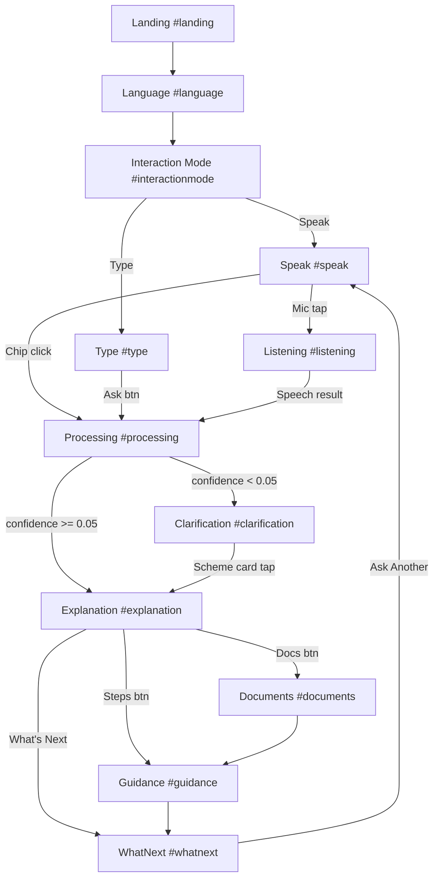

# SaralAI — Complete Project Document
### Voice-First Government Services Assistant · Technical & Architecture Reference

> Last updated: March 2026 · Version: MVP Frontend Complete

---

## Table of Contents

1. [Project Identity](#1-project-identity)
2. [What Is Done vs Remaining](#2-what-is-done-vs-remaining)
3. [System Architecture](#3-system-architecture)
4. [Frontend — Full Breakdown](#4-frontend--full-breakdown)
   - [Project Setup](#41-project-setup)
   - [Design System & CSS](#42-design-system--css)
   - [Routing](#43-routing--routerjs)
   - [State Management](#44-state-management--statejs)
   - [AI Query Engine](#45-ai-query-engine--aijs)
   - [Icons Library](#46-icons-library--iconsjs)
   - [Components](#47-components-8-files)
   - [Screens](#48-screens-12-files)
5. [Backend — Full Plan](#5-backend--full-plan)
   - [Technology Stack](#51-technology-stack)
   - [API Endpoints](#52-api-endpoints)
   - [Services](#53-services)
   - [AI Integration](#54-ai-integration)
   - [Data Models](#55-data-models)
6. [Data Layer — Schemes.json](#6-data-layer--schemesjson)
7. [Complete User Flow](#7-complete-user-flow)
8. [Verification Status](#8-verification-status)

---

## 1. Project Identity

| Field | Value |
|-------|-------|
| **Name** | SaralAI (सरल AI) |
| **Meaning** | "Simple AI" in Hindi |
| **Tagline** | "A simple helper to understand government services" |
| **Type** | Voice-first AI assistant for government scheme guidance |
| **Stack** | Vite + Vanilla JS (frontend) · Node.js/FastAPI (backend — planned) |
| **Run** | `cd c:\Users\siddh\Desktop\SaralAI && npm run dev` → http://localhost:5173 |

### What SaralAI IS vs IS NOT

| ✅ SaralAI IS | ❌ SaralAI IS NOT |
|--------------|-----------------|
| A voice-first **explainer** of government schemes | A scheme discovery engine (myScheme does this) |
| A **simplifier** of complex government language | A government portal replacement |
| A **step-by-step guide** for applying | An application submission system |
| A **complementary layer** on top of myScheme | A ChatGPT/Gemini clone |
| A **client-side, stateless guidance** tool | An eligibility decision maker |

---

## 2. What Is Done vs Remaining

### ✅ DONE — Frontend (Current Session)

| Phase | What Was Built |
|-------|---------------|
| **Project Foundation** | Vite app, `index.html`, `package.json`, `src/styles/index.css` design system |
| **Routing** | `src/router.js` — hash-based router for 12 routes |
| **State Management** | `src/state.js` — app-wide state with scheme result storage |
| **Icons Library** | `src/icons.js` — SVG icon kit (mic, check, arrows, gov, etc.) |
| **Components** | All 8 components: Header, Button, MicButton, LanguageCard, AudioPlayer, ProgressIndicator, ChecklistItem, StepCard |
| **All 12 Screens** | LandingScreen, LanguageScreen, InteractionModeScreen, SpeakScreen, TypeScreen, ListeningScreen, ProcessingScreen, ExplanationScreen, ClarificationScreen, WhatNextScreen, DocumentsScreen, GuidanceScreen |
| **AI Engine** | `src/ai.js` — keyword-based scheme search + intent detection across all 10 MVP schemes |
| **Scheme Data** | `src/Schemes.json` — all 10 MVP schemes curated with full details |
| **Data Integration** | ProcessingScreen runs real queries → ExplanationScreen shows real scheme data → DocumentsScreen pulls real documents → GuidanceScreen shows real steps |
| **Voice Input** | Web Speech API integrated into SpeakScreen + ListeningScreen |
| **Clarification** | ClarificationScreen shows top 4 matching scheme cards when query is unclear |
| **WhatNext** | Fully dynamic summary with real scheme name, category, and official portal link |

### ❌ REMAINING — Backend & Deployment

| Phase | What Needs Building |
|-------|-------------------|
| **Backend API** | Node.js/FastAPI endpoints for `/api/query`, `/api/scheme`, `/api/intent` |
| **Real STT** | Google Cloud Speech or Azure STT for Indian language accuracy |
| **Real TTS** | Google TTS or Azure TTS for voice playback of explanations |
| **LLM Integration** | Gemini/OpenAI API for advanced simplification prompts |
| **Database** | PostgreSQL for scheme data (currently client-side JSON) |
| **PWA** | Service worker, offline mode, installable |
| **Deployment** | Vercel/Railway frontend, Cloud Run backend |
| **Multi-language UI** | Hindi/regional language text in all screens |
| **Analytics** | Privacy-safe usage analytics |

---

## 3. System Architecture

### High-Level Flow

```
User (Voice/Text)
       │
       ▼
┌──────────────────────────┐
│    FRONTEND (Vite App)   │
│  http://localhost:5173   │
│                          │
│  ┌─────────────────────┐ │
│  │  src/router.js      │ │  ← Hash router (#landing, #speak, etc.)
│  │  src/state.js       │ │  ← Shared state (query, scheme, language)
│  │  src/ai.js          │ │  ← Client-side AI engine
│  │  src/Schemes.json   │ │  ← Curated scheme knowledge base
│  │  src/screens/       │ │  ← 12 screen modules
│  │  src/components/    │ │  ← 8 reusable UI components
│  └─────────────────────┘ │
└──────────────────────────┘
       │
       ▼ (PLANNED — not yet built)
┌──────────────────────────┐
│    BACKEND API           │
│  (Node.js / FastAPI)     │
│                          │
│  POST /api/query         │
│  POST /api/speech-to-text│
│  POST /api/text-to-speech│
│  GET  /api/scheme/:id    │
│  POST /api/intent        │
└──────────────────────────┘
       │
       ▼
┌──────────────────────────┐
│  EXTERNAL SERVICES       │
│  ├── Google STT API      │
│  ├── Google TTS API      │
│  ├── Gemini/OpenAI LLM   │
│  └── PostgreSQL DB       │
└──────────────────────────┘
```

### Data Flow (Current — Client-Side)

```
User types query (TypeScreen)
         │
         ▼
setState({ currentQuery })           [src/state.js]
         │
navigate('processing')               [src/router.js]
         │
         ▼
processQuery(query)                  [src/ai.js]
  ├── searchSchemes(query)
  │     └── scores all 10 schemes by keyword overlap
  │         returns ranked [{scheme, confidence}]
  ├── detectIntent(query)
  │     └── classifies as OVERVIEW/ELIGIBILITY/DOCUMENTS/STEPS
  └── generateExplanation(scheme, intent)
        └── returns structured explanation object
         │
         ▼
confidence < 0.05?
  ├── YES → navigate('clarification')   shows top 4 scheme cards
  └── NO  → setState({ currentScheme, currentExplanation, currentIntent })
              navigate('explanation')
                   │
                   ├── Documents btn → navigate('documents')
                   │     pulls state.currentScheme.required_documents
                   └── Steps btn → navigate('guidance')
                         pulls state.currentScheme.application_process.steps
```

### Navigation Flow



---

## 4. Frontend — Full Breakdown

### 4.1 Project Setup

**`index.html`** — Single HTML entry point
```html
<div id="app"></div>
<script type="module" src="/src/main.js"></script>
```
- `#app` is the mount point for all screens
- `type="module"` enables ES module imports across all JS files

**`package.json`** — Minimal deps
```json
{ "scripts": { "dev": "vite", "build": "vite build" }, "devDependencies": { "vite": "^7.2.4" } }
```
No React, no framework. Pure vanilla JS with Vite for bundling. Vite handles hot module reload, ES module bundling, fast dev server.

**`src/main.js`** — App entry point (452 lines)
- Imports all 12 screens and 8 components
- Calls `injectStyles()` — collects all CSS exported from screen/component files and appends to `<head>`
- Calls `initRouter()` — starts hash-based routing
- Defines global `window.SaralAI.showToast()`, `showLoading()`, `hideLoading()` utilities
- Defines shared animation CSS: screen transitions, sound wave animation, skeleton loading, glassmorphism, stagger effects

---

### 4.2 Design System — `src/styles/index.css`

All CSS variables defined in `:root`. Every value referenced as CSS custom property.

**Color Palette (Government Trust)**
```css
--color-primary: #2563EB        /* Government blue */
--color-primary-dark: #1D4ED8
--color-primary-bg: rgba(37,99,235,0.08)
--color-bg: #F7F8FA             /* Light page background */
--color-bg-card: #FFFFFF        /* Card backgrounds */
--color-text-primary: #1A1A2E
--color-text-secondary: #64748B
--color-text-muted: #94A3B8
--color-success: #10B981
--color-error: #EF4444
```

**Typography Scale**
```css
--font-family: 'Inter', -apple-system, sans-serif
--font-size-xs: 0.75rem  (12px)
--font-size-sm: 0.875rem (14px)
--font-size-base: 1rem   (16px)
--font-size-lg: 1.125rem (18px)
--font-size-xl: 1.25rem  (20px)
--font-size-2xl: 1.5rem  (24px)
--font-size-3xl: 1.875rem (30px)
```

**Spacing Scale**: `--space-1` (4px) → `--space-20` (80px)

**Border Radius**: `--radius-sm` (6px) → `--radius-full` (9999px)

**Animation keyframes defined**: `fadeIn`, `slideUp`, `slideDown`, `scaleIn`, `bounce`, `wave`, `shimmer`

**Utility classes**: `.container`, `.screen`, `.screen-content`, `.screen-center`, `.card`, `.card-interactive`, `.card-selected`, `.btn`, `.btn-primary/secondary/ghost/dark/lg/sm`, `.icon/icon-sm/icon-lg/icon-xl`, `.animate-fadeIn/slideUp/etc.`

---

### 4.3 Routing — `src/router.js`

**How it works**: Hash-based routing using `window.location.hash`

```js
// All 12 routes
const routes = {
  landing, language, interactionmode, speak, type,
  listening, processing, explanation, guidance,
  documents, clarification, whatnext
}

// Navigation
function navigate(route) {
  window.location.hash = route;  // triggers hashchange event
}

// On hashchange → calls onRouteChangeCallback
// main.js registers: onRouteChange(route => renderScreen(route))
// renderScreen adds exit animation, then calls screen.render() + screen.init()
```

**Key design decisions**:
- Hash router = no server-side routing needed, works on any static host
- Each screen is rendered as an HTML string, not a real DOM tree (no virtual DOM)
- `exit animation (200ms)` → clear `#app.innerHTML` → render new screen string → call `init()` for event bindings

---

### 4.4 State Management — `src/state.js`

Flat singleton object with pub/sub listeners.

```js
const state = {
  // Language
  selectedLanguage: 'en',
  languages: [{code, native, english}],  // 8 languages

  // Interaction
  interactionMode: 'voice',   // 'voice' | 'text'
  isListening: false,
  isProcessing: false,

  // Query
  currentQuery: '',           // User's typed/spoken question

  // Step tracking
  currentStep: 1,
  totalSteps: 3,

  // Query Results (set by ProcessingScreen after ai.js runs)
  currentScheme: null,        // Full scheme object from Schemes.json
  currentIntent: null,        // 'OVERVIEW' | 'ELIGIBILITY' | 'DOCUMENTS' | 'STEPS'
  currentExplanation: null,   // { schemeName, summary, eligibilityPoints, benefitPoints, steps, ... }
  topMatches: [],             // All ranked scheme matches (for clarification screen)
  queryHistory: []            // All previous queries this session
}
```

**API**:
- `getState()` → returns shallow copy of state
- `setState(updates)` → merges updates, notifies all subscribers
- `subscribe(fn)` → registers listener, returns unsubscribe fn
- `getSelectedLanguage()` → returns language object for current code
- `setSelectedLanguage(code)` → convenience wrapper

---

### 4.5 AI Query Engine — `src/ai.js`

**Purpose**: Replaces a backend AI service with a pure client-side JavaScript keyword engine. Reads all data from `Schemes.json` at import time.

#### `searchSchemes(query)` — Scheme Search

Scores all 10 schemes using keyword overlap:

```js
// Each scheme has a keyword list like:
SCHEME_KEYWORDS = {
  PM_KISAN: ['kisan', 'farmer', 'kheti', 'pm kisan', 'samman nidhi', ...],
  PM_JAY: ['ayushman', 'health', 'hospital', 'cashless', 'bimari', ...],
  ...
}

// Scoring algorithm:
function scoreScheme(query, schemeId, scheme) {
  let score = 0, totalWeight = 0;
  // 1. Direct keyword match: score += 1 per keyword hit
  // 2. Scheme name word match: score += 0.5
  // 3. Category match: score += 0.3
  return score / totalWeight;  // 0–1 confidence
}
```

Returns `[{scheme, confidence}]` sorted descending.

#### `detectIntent(query)` — Intent Classification

Four intent buckets with keyword lists:
```js
INTENT_KEYWORDS = {
  DOCUMENTS: ['document', 'papers', 'kya chahiye', 'kaagaz', 'aadhaar', ...],
  STEPS: ['apply', 'kaise', 'process', 'karna', 'fill', 'form', ...],
  ELIGIBILITY: ['eligible', 'kaun', 'paatra', 'milega', 'can i apply', ...],
  OVERVIEW: ['what is', 'kya hai', 'explain', 'batao', 'yojana', ...]
}
```
Counts keyword matches per intent bucket → returns highest scoring intent.

#### `generateExplanation(scheme, intent)` — Response Generator

Reads from scheme object, builds a structured response:
```js
return {
  schemeId, schemeName, category, intent,
  summary,              // context-aware lead sentence
  leadPoints,           // primary bullets based on intent
  eligibilityPoints,    // from scheme.eligibility_criteria[].condition
  benefitPoints,        // from scheme.benefits.details[]
  steps,                // from scheme.application_process.steps[]
  documents,            // from scheme.required_documents[]
  confusions,           // from scheme.common_confusions[]
  limitations,          // from scheme.limitations_and_notes[]
  officialSource,       // from scheme.source_information.official_website
  applicationMode,      // from scheme.application_process.mode
  disclaimer: 'This information is for guidance only.'
}
```

#### `processQuery(query)` — Main Pipeline

```js
export function processQuery(query) {
  const ranked = searchSchemes(query);       // search all 10 schemes
  const { scheme, confidence } = ranked[0]; // top match
  if (confidence < 0.05) return { result: null, confidence, topMatches: ranked };
  const intent = detectIntent(query);        // classify intent
  const result = generateExplanation(scheme, intent);
  return { result, confidence, topMatches: ranked };
}
```

**Threshold**: confidence < 0.05 → go to Clarification screen. ≥ 0.05 → show Explanation.

---

### 4.6 Icons Library — `src/icons.js`

Returns inline SVG strings. Used as `${getIcon('mic', 'icon')}` inside HTML template literals.

**Available icons**: `mic`, `micOff`, `stop`, `waves`, `arrowRight`, `arrowLeft`, `check`, `x`, `info`, `government`, `keyboard`, `translate`, `idCard`, `language`

Each icon is a pure SVG `<svg viewBox="0 0 24 24">` with `currentColor` stroke, no external files needed.

---

### 4.7 Components (8 Files)

#### `Header.js` — Sticky top bar
- **Props**: `showNav`, `showLanguageToggle`, `showVoiceAssist`, `showBack`
- Shows SaralAI logo (links to #landing) by default
- `showLanguageToggle=true` → shows "English / English" pill → navigates to #language on click
- `showNav=true` → shows nav links (Home, Services, Language, Help)
- `initHeader()` → attaches click listeners to back and language toggle buttons

#### `Button.js` — Reusable button
- **Props**: `text`, `variant` (primary/secondary/ghost/dark), `size` (default/lg/sm), `icon`, `iconPosition`, `fullWidth`, `id`, `disabled`
- Returns HTML string: `<button class="btn btn-{variant} btn-{size}">`
- Icons rendered inline from `icons.js`

#### `MicButton.js` — Microphone button
- `MicButton({size, isListening, id})` → large circle button with pulse animation rings
- `MicButtonSmall({id, text})` → compact mic button with label below
- Animated CSS rings expand outward when `isListening=true`

#### `LanguageCard.js`
- `LanguageCard({code, native, english, selected})` → single language card
- `LanguageGrid(languages, selectedLanguage)` → 2×4 grid of language cards
- Selected state: blue border + checkmark overlay

#### `AudioPlayer.js`
- `AudioPlayer({title, subtitle, duration, currentTime})` → "Listen to explanation" card
- Shows waveform animation bars, play/pause button, time display
- Currently static (no real audio — TTS integration planned for backend phase)

#### `ProgressIndicator.js`
- `ProgressIndicator({current, total, label})` → progress bar + step label
- Used in GuidanceScreen to show "Step 2 of 5"
- CSS animated fill bar

#### `ChecklistItem.js`
- `ChecklistItem({title, subtitle, icon, checked, id})` → tappable document item
- `Checklist(items)` → stacked list of checklist items
- Checkbox animates to filled blue when checked
- Used in DocumentsScreen for required documents list

#### `StepCard.js`
- `StepCard({number, title, description, icon, active})` → single numbered step card
- `NumberedSteps(stepsArray)` → renders step list
- Used in legacy ExplanationScreen (now inline numbered list used in rewrite)

---

### 4.8 Screens (12 Files)

Each screen file exports three things:
1. `ScreenName()` → returns HTML string (pure function, no DOM access)
2. `initScreenName()` → called after render, attaches event listeners
3. `screenNameStyles` → CSS string injected into `<head>` by `main.js`

---

#### `LandingScreen.js` — Route: `#landing`

**What it does**: Welcome screen. Builds trust, explains purpose in one line.

**Key elements**:
- Animated concentric ring icon (government building SVG inside blue circle)
- Heading: "A simple helper to understand government services"
- Subtitle: "Voice-first AI assistant"
- Single "Start" button → navigates to `#language`

**No state reads, no data dependencies.** Pure UI.

---

#### `LanguageScreen.js` — Route: `#language`

**What it does**: Language selection. Ensures user comfort from first interaction.

**Key elements**:
- Reads `state.languages` (8 languages: en, hi, bn, te, mr, ta, gu, kn)
- Renders `LanguageGrid` component
- On card click: calls `setSelectedLanguage(code)`, adds checkmark, removes previous selection
- "Continue" button → navigates to `#interactionmode`
- Footer hint with mic icon: "You can also say the name of the language"

**State written**: `selectedLanguage`

---

#### `InteractionModeScreen.js` — Route: `#interactionmode`

**What it does**: Choose between voice (Speak) or keyboard (Type) input.

**Key elements**:
- Two large card-buttons: "Speak" (primary, blue gradient) and "Type" (secondary, grey)
- "Speak" card has "Recommended" badge
- Click Speak → setState `interactionMode: 'voice'` → navigate `#speak`
- Click Type → setState `interactionMode: 'text'` → navigate `#type`
- Footer: "You can switch between modes anytime"

Auto-proceeds on selection (no extra continue button).

---

#### `SpeakScreen.js` — Route: `#speak`

**What it does**: Primary voice query entry point.

**Key elements**:
- Large `MicButton` center-stage with pulsing rings
- Example query: "Ghar ke liye sarkari madad kaise milegi?"
- 4 quick example chips (PM Kisan, PMAY, Ayushman, Ration Card) — clicking any chip sets `currentQuery` directly and navigates to `#processing` (bypasses voice)
- "Type instead" link → `#type`

**Voice logic**:
```js
// Mic tap with Speech API support:
recognition = new SpeechRecognition();
recognition.lang = 'hi-IN,en-IN';
window._saralaiRecognition = recognition; // pass to ListeningScreen
recognition.start();
navigate('listening');

// Without Speech API support:
navigate('type');  // graceful fallback
```

---

#### `TypeScreen.js` — Route: `#type`

**What it does**: Keyboard input fallback/alternative.

**Key elements**:
- `<textarea>` with 500 char limit counter
- Example query placeholder text
- 4 quick chips: Aadhaar Card, PM Awas Yojana, Ration Card, Pension Scheme — clicking populates textarea
- "Ask →" button: reads textarea value → `setState({ currentQuery })` → `navigate('processing')`
- "Prefer to speak instead?" link → `#speak`
- Input auto-focuses after 300ms delay

---

#### `ListeningScreen.js` — Route: `#listening`

**What it does**: Real-time speech recognition feedback.

**Key elements**:
- Animated mic button (pulsing rings active state)
- Status text: "Sun raha hoon…" / "Listening…"
- Transcript box appears when speech is recognized
- "Stop" button → stops recognition → navigates back to `#speak`

**Speech logic**:
```js
// Gets recognition instance created by SpeakScreen
const recognition = window._saralaiRecognition;

recognition.onresult = (event) => {
  const transcript = event.results[0][0].transcript;
  // Shows transcript in UI
  setState({ currentQuery: transcript });
  setTimeout(() => navigate('processing'), 700);
};

recognition.onerror = () => {
  // Navigate back to speak after 2s
};
```

**Fallback**: If navigated to directly (no recognition), demo timer redirects to `#speak` after 3s.

---

#### `ProcessingScreen.js` — Route: `#processing`

**What it does**: THE BRAIN — runs the actual query, determines where to go.

**Key elements**:
- Animated processing rings + wave icon
- Hindi: "Samajh raha hoon…" / English: "Finding the best information for you"
- Query badge shows the user's question text
- "Cancel" button → back to `#speak`
- Status text updates as pipeline runs

**Pipeline**:
```js
// On init:
setTimeout(() => {
  // 1. Read query from state
  const query = getState().currentQuery;
  if (!query) { navigate('clarification'); return; }

  // 2. Run AI pipeline
  const { result, confidence, topMatches } = processQuery(query);

  // 3. Store top matches for clarification screen
  setState({ topMatches });

  // 4. Route based on confidence
  if (confidence < 0.05 || !result) {
    navigate('clarification');
  } else {
    setState({ currentScheme: topMatches[0].scheme, currentExplanation: result, currentIntent: result.intent });
    navigate('explanation');
  }
}, 600 + 800);  // Visual delays for UX feel
```

---

#### `ExplanationScreen.js` — Route: `#explanation`

**What it does**: Core value delivery — the simplified scheme explanation.

**Key elements** (all data-driven):
- Category badge (e.g., "Housing", "Health Assurance")
- Scheme name as H1 (e.g., "Pradhan Mantri Kisan Samman Nidhi")
- Summary sentence from explanation object
- `AudioPlayer` component (static UI — no real audio yet)
- **Sections based on intent**:
  - `OVERVIEW` / `ELIGIBILITY`: "Who is this for?" bullets + "What are the benefits?" bullets
  - `DOCUMENTS`: Document list with ✓/optional labels
  - `STEPS`: Numbered application steps
- Application mode badge ("Offline / Assisted")
- Red disclaimer box with official source link
- Action buttons: Back | What's Next → WhatNext | Documents needed → Documents | Step-by-step → Guidance | Ask Another Question

**Fallback**: If no `currentExplanation` in state (e.g., direct URL), shows "No query found" with prompt to ask a question.

---

#### `ClarificationScreen.js` — Route: `#clarification`

**What it does**: When query is too vague, shows matching schemes to choose from.

**Key elements**:
- Shows current query in a badge: `"help me please"`
- Up to 4 scheme cards from `state.topMatches`, each with:
  - Category emoji (🏠 Housing, 🌾 Farmer, 🏥 Health, etc.)
  - Scheme name
  - Short description (`who_is_it_for.short`)
  - Arrow icon
- **On card tap**:
  ```js
  const selectedScheme = topMatches[idx].scheme;
  const intent = detectIntent(currentQuery);
  const explanation = generateExplanation(selectedScheme, intent);
  setState({ currentScheme, currentIntent, currentExplanation });
  navigate('explanation');
  ```
- Divider: "or ask again"
- Mic button → `#speak`
- Type button → `#type`
- 6 example chips with pre-filled queries (PM Kisan, PMAY, Ayushman, etc.)

---

#### `DocumentsScreen.js` — Route: `#documents`

**What it does**: Shows the document checklist for the current scheme.

**Key elements**:
- Title: "Documents You May Need" + scheme name subtitle
- Reads `state.currentScheme.required_documents`
- Splits into required (✅ label) and optional sections
- Each document rendered as `ChecklistItem` (clickable to toggle check)
- TTS "Read this to me" button → uses `window.speechSynthesis` to read docs aloud
- "I have these documents →" → `#guidance`
- Note card: "Requirements may vary by State and local office"
- Fallback docs shown if no scheme data in state

---

#### `GuidanceScreen.js` — Route: `#guidance`

**What it does**: Step-by-step application process tracker.

**Key elements**:
- Header + scheme name subtitle
- Application mode badge (Online / Offline / Assisted)
- `ProgressIndicator` component showing "Step N of M"
- Timeline steps from `state.currentScheme.application_process.steps`:
  - Completed steps → green checkmark circle + strikethrough text
  - Active step → blue number + "Current Step" badge + highlighted text
  - Pending steps → grey outlined circle
- "Mark Step Done →" button → increments `state.currentStep` → re-renders screen
- When all steps done → "✓ All steps noted!" → navigates to `#whatnext`
- Official portal link card
- Warning disclaimer box
- "Ask Another Question" → clears state + `#speak`

---

#### `WhatNextScreen.js` — Route: `#whatnext`

**What it does**: Summary + follow-up options after exploring a scheme.

**Key elements**:
- Summary card with scheme name, description, category badge (all from state)
- Government icon in blue box
- "What would you like to do next?" heading
- 4 option buttons: Explain again | Documents | Step-by-step | Ask another question
- Official portal link
- Disclaimer: "This information is for guidance only"
- Small mic button (tap to speak new query)

**"Ask Another Question"** resets: `currentScheme`, `currentExplanation`, `currentIntent`, `currentQuery`, `currentStep` all cleared before navigating to `#speak`.

---

## 5. Backend — Full Plan

> ⚠️ The backend is **not yet built**. The current frontend uses a client-side AI engine. This section documents the full plan for the production backend.

### 5.1 Technology Stack

| Layer | Choice | Reason |
|-------|--------|--------|
| Runtime | Node.js (Express) or Python (FastAPI) | Fast REST APIs |
| Database | PostgreSQL + JSON columns | Structured scheme data |
| AI | Google Gemini API or OpenAI GPT-4 | Advanced simplification |
| STT | Google Cloud Speech-to-Text | Indian language accuracy |
| TTS | Google Cloud Text-to-Speech | Natural Indian voice |
| Cache | Redis | Rate limit, session cache |
| Hosting | Google Cloud Run / Railway | Auto-scale, low cold start |

### 5.2 API Endpoints

#### `POST /api/query`
Main query pipeline endpoint.

**Request**:
```json
{
  "query": "PM Kisan scheme kya hai",
  "language": "hi",
  "session_id": "optional-uuid"
}
```
**Response**:
```json
{
  "type": "explanation",
  "intent": "OVERVIEW",
  "confidence": 0.82,
  "content": {
    "scheme_name": "Pradhan Mantri Kisan Samman Nidhi (PM-KISAN)",
    "category": "Farmers / Income Support",
    "summary": "Direct income support for landholding farmer families",
    "eligibility_points": ["..."],
    "benefit_points": ["..."],
    "steps": ["..."],
    "documents": [{"name": "Aadhaar", "mandatory": true}],
    "official_source": "https://pmkisan.gov.in",
    "disclaimer": "This information is for guidance only."
  },
  "needs_clarification": false,
  "clarification_options": []
}
```

#### `POST /api/speech-to-text`
**Input**: Audio binary (WebM/WAV/OGG)
**Output**: `{ text, language, confidence }`

#### `POST /api/text-to-speech`
**Input**: `{ text, language: "hi" }`
**Output**: Audio stream (MP3/WebM)

#### `GET /api/scheme/:schemeId`
**Output**: Full scheme JSON from database

#### `POST /api/intent`
**Input**: `{ text, language }`
**Output**: `{ intent, scheme_id, confidence }`

### 5.3 Services

**`services/ai.js`** (or `services/ai.py`)
```js
async function simplifyScheme(scheme, intent, language) {
  const prompt = buildSystemPrompt(language);
  const facts = JSON.stringify(schemeToFacts(scheme));
  const response = await gemini.generateContent({
    systemInstruction: prompt,
    contents: [{ role: 'user', parts: [{ text: `Facts: ${facts}\nQuestion: ${userQuery}` }] }]
  });
  return parseResponse(response);
}
```

**`services/stt.js`**
```js
async function transcribeAudio(audioBuffer, languageCode = 'hi-IN') {
  const client = new SpeechClient();
  const [response] = await client.recognize({
    audio: { content: audioBuffer.toString('base64') },
    config: { languageCode, alternativeLanguageCodes: ['en-IN'] }
  });
  return response.results[0].alternatives[0].transcript;
}
```

**`services/tts.js`**
```js
async function textToSpeech(text, language = 'hi-IN') {
  const client = new TextToSpeechClient();
  const [response] = await client.synthesizeSpeech({
    input: { text },
    voice: { languageCode: language, ssmlGender: 'FEMALE' },
    audioConfig: { audioEncoding: 'MP3' }
  });
  return response.audioContent;
}
```

### 5.4 AI Integration

**System Prompt Template**:
```
You are a public-service explainer for Indian government schemes.

RULES:
• Use ONLY the provided facts — never add information
• Explain in very simple {language}
• Use bullet points and short sentences
• Maximum 5 main points
• No technical or legal terms
• Do NOT guarantee eligibility or benefits
• Always end with: "Yeh sirf jaankari ke liye hai / This is for guidance only"

TONE: Calm, respectful, patient, human-like, non-judgmental

FACTS:
{scheme_data_json}

USER QUESTION:
{user_query}

YOUR TASK: Explain the relevant information simply and clearly.
```

**Intent Detection Prompt**:
```
Classify into ONE of: SCHEME_OVERVIEW, ELIGIBILITY, DOCUMENTS, APPLICATION_STEPS, CLARIFICATION_NEEDED
Query: "{query}", Language: {language}
Respond: { "intent": "TYPE", "scheme_mentioned": "name or null", "confidence": 0.0-1.0 }
```

### 5.5 Data Models

**Scheme** (PostgreSQL):
```sql
CREATE TABLE schemes (
  scheme_id VARCHAR(20) PRIMARY KEY,
  scheme_name TEXT NOT NULL,
  category VARCHAR(50),
  who_is_it_for JSONB,
  benefits JSONB,
  eligibility_criteria JSONB,
  required_documents JSONB,
  application_process JSONB,
  common_confusions JSONB,
  limitations_and_notes JSONB[],
  source_information JSONB,
  ai_usage_rules JSONB,
  last_verified_on DATE
);
```

**Session** (Redis, TTL 30min):
```json
{
  "session_id": "uuid",
  "language": "hi",
  "query_history": ["PM Kisan kya hai", "documents needed"],
  "current_scheme_id": "PM_KISAN"
}
```

---

## 6. Data Layer — Schemes.json

Location: `src/Schemes.json` — 666 lines, 37KB

Contains all 10 MVP schemes, curated and verified from official government portals.

| # | scheme_id | Scheme Name | Category |
|---|-----------|-------------|----------|
| 1 | `PMAY_U` | Pradhan Mantri Awas Yojana Urban | Housing |
| 2 | `PMAY_G` | Pradhan Mantri Awas Yojana Gramin | Housing |
| 3 | `PM_KISAN` | PM Kisan Samman Nidhi | Farmers |
| 4 | `PM_JAY` | Ayushman Bharat PM-JAY | Health |
| 5 | `NFSA_PDS` | Ration Card (NFSA) | Food Security |
| 6 | `PMJDY` | PM Jan Dhan Yojana | Banking |
| 7 | `SSY` | Sukanya Samriddhi Yojana | Savings/Child |
| 8 | `PMUY` | PM Ujjwala Yojana | LPG/Energy |
| 9 | `NSAP` | National Social Assistance (Pensions) | Social Pensions |
| 10 | `PMKVY` | PM Kaushal Vikas Yojana | Skill Dev |
| 11 | `NSP` | National Scholarship Portal | Education |

**Each scheme has**: `scheme_id`, `scheme_name`, `category`, `coverage`, `who_is_it_for` (short + detailed), `benefits` (short + details), `eligibility_criteria[]` (with `mandatory` flag), `required_documents[]` (with `mandatory` flag), `application_process` (mode + steps), `common_confusions[]`, `limitations_and_notes[]`, `source_information` (official_website + myscheme_page + last_verified_on), `ai_usage_rules` (can_explain, can_simplify, can_decide_eligibility: **false**, can_guarantee_benefit: **false**)

---

## 7. Complete User Flow

### Happy Path — Text Query

```
1. User opens http://localhost:5173
   → Landing screen: "A simple helper to understand government services"
   → Click "Start"

2. Language Selection
   → User taps "हिंदी" card
   → Hindi is selected (blue border, checkmark)
   → Click "Continue"

3. Interaction Mode
   → Two cards: Speak (recommended) | Type
   → User taps "Type"

4. Type Screen
   → Textarea with placeholder "E.g., How can I apply for a ration card?"
   → User types: "PM Kisan scheme kya hai"
   → Click "Ask →"
   → setState({ currentQuery: 'PM Kisan scheme kya hai' })
   → navigate('processing')

5. Processing Screen
   → Shows "Samajh raha hoon…"
   → Shows query badge: "PM Kisan scheme kya hai"
   → After 600ms: calls processQuery('PM Kisan scheme kya hai')
     → searchSchemes() → PM_KISAN scores 0.82 (highest)
     → detectIntent() → OVERVIEW
     → generateExplanation(PM_KISAN, OVERVIEW)
   → confidence = 0.82 ≥ 0.05 → setState results
   → navigate('explanation')

6. Explanation Screen
   → Category badge: "Farmers / Income Support"
   → Title: "Pradhan Mantri Kisan Samman Nidhi (PM-KISAN)"
   → Summary: "Direct income support transferred to bank accounts"
   → Who is it for bullets: landholding farmers, eKYC required, etc.
   → Benefits: "Direct transfer of income support in equal instalments"
   → Audio player (static UI)
   → Disclaimer + official link: pmkisan.gov.in
   → Buttons: Back | What's Next? | Documents needed | Step-by-step | Ask Another Question

7. User clicks "Documents needed"
   → Documents Screen
   → Required: Aadhaar of farmer, Land ownership documents, Bank account details, Mobile number
   → Optional: none
   → "I have these documents →" → Guidance

8. User clicks "I have these documents →"
   → Guidance Screen
   → Steps: Register via agriculture department / CSC / PM-KISAN portal → eKYC via OTP → Verification → Receive instalments
   → Application mode badge: "Online / Offline / Assisted"
   → "Mark Step Done →" advances step counter
   → Official portal: pmkisan.gov.in

9. User completes steps → WhatNext Screen
   → Shows: "You asked about Pradhan Mantri Kisan Samman Nidhi"
   → Summary text
   → Buttons: Explain again | Documents | Steps | Ask another question
   → Disclaimer reminder

10. User clicks "Ask another question"
    → State cleared: currentScheme, currentExplanation, currentQuery all null
    → navigate('speak') → back to start for new query
```

### Clarification Path — Vague Query

```
User types "help me" → Processing → confidence = 0.02 < 0.05
→ navigate('clarification')
→ Shows top 4 scheme cards: PMAY Urban, PMAY Gramin, PM Kisan, PM JAY
→ User taps "Pradhan Mantri Awas Yojana Urban"
→ detectIntent('help me') → OVERVIEW
→ generateExplanation(PMAY_U, OVERVIEW)
→ setState results → navigate('explanation')
→ Shows PMAY Urban explanation
```

### Voice Path

```
User taps mic on SpeakScreen
→ SpeechRecognition starts with lang='hi-IN,en-IN'
→ window._saralaiRecognition = recognition
→ navigate('listening')
→ ListeningScreen gets recognition from window._saralaiRecognition
→ User speaks: "Ghar ke liye sarkar madad"
→ recognition.onresult → transcript = "गृह के लिए सरकार मदद" or English
→ setState({ currentQuery: transcript })
→ navigate('processing')
→ [same as text query path from step 5]
```

---

## 8. Verification Status

### ✅ Confirmed Working (Code-Level Analysis)

| Feature | How Verified |
|---------|-------------|
| All 12 routes registered | `router.js` routes object + `main.js` screen mapping |
| Schemes.json imported in ai.js | `import schemes from './Schemes.json'` |
| State fields exist | `state.js` shows all required fields |
| ProcessingScreen calls processQuery | Code verified |
| ExplanationScreen reads state | `getState().currentExplanation` |
| DocumentsScreen reads scheme.required_documents | Code verified |
| GuidanceScreen reads application_process.steps | Code verified |
| ClarificationScreen reads topMatches | Code verified |
| WhatNextScreen reads currentScheme | Code verified |
| Web Speech API in SpeakScreen | `new SpeechRecognition()` call present |
| Speech result → state.currentQuery | ListeningScreen.onresult verified |
| Confidence threshold 0.05 | ProcessingScreen logic verified |
| Fallback on no speech support | `navigate('type')` in SpeakScreen |

### 📋 How to Manually Test

```
1. npm run dev  (in c:\Users\siddh\Desktop\SaralAI)
2. Open http://localhost:5173

Happy path:
→ Start → English → Continue → Type → "PM Kisan scheme kya hai" → Ask
→ Wait 2s → Explanation screen should show "Pradhan Mantri Kisan Samman Nidhi"
→ Click "Documents needed" → Should show Aadhaar, Land docs, Bank account
→ Click "I have these documents" → Should show PM Kisan steps

Clarification path:
→ Type → "help" → Ask
→ Should show clarification with 4 scheme cards

Voice input:
→ Start → English → Continue → Speak → tap mic
→ Say "Ayushman Bharat" → should navigate through processing to Ayushman scheme

Quick chips:
→ #speak → click "PM Kisan" chip → should bypass voice and show PM-KISAN explanation
```

### ⚠️ Known Frontend Limitations (Next Steps)

| Limitation | Impact | Fix |
|------------|--------|-----|
| AudioPlayer is static UI | Can't listen to explanations | Connect TTS API |
| Web Speech API only works in Chrome | Firefox/Safari users must type | Server-side STT |
| No real language switching in UI text | UI stays English even if Hindi selected | i18n text maps |
| Keyword search misses Hinglish phrases | Some queries won't match | LLM intent detection |
| Step "Mark Done" re-navigates (flicker) | Minor UX issue | State-based re-render |
